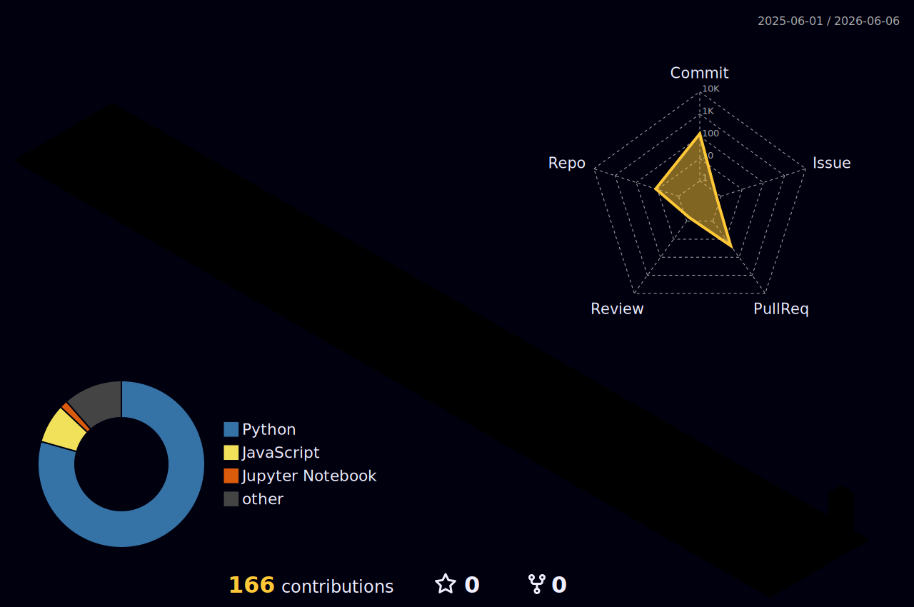

꾸준히 배우고, 직접 만들어보며 성장하는 개발자입니다.
문제를 구조화하고, 필요한 기능을 실제 서비스로 구현하는 과정에 관심이 많습니다.

 

## 🌌 3D Contributions

<picture>
  <source media="(prefers-color-scheme: dark)" srcset="./profile-3d-contrib/profile-night-rainbow.svg" />
  <source media="(prefers-color-scheme: light)" srcset="./profile-3d-contrib/profile-season-animate.svg" />
  
</picture>

 

---

## 🧑‍💻 About Me

- 🔭 GitHub ID: **space1637**
- 🤖 **AI 에이전트 · LLM 앱**을 만들고, 대회·해커톤에서 검증합니다
- 🌱 Currently into **LLM agents, Web development, Automation**
- 🛠 만들면 반드시 테스트하고, 스펙은 믿지 말고 직접 측정합니다
- ✨ I value clean code, readable documentation, and steady growth

 

---

## 🛠 Tech Stack

### Languages

  

### Frameworks & AI

  

### Tools & Design

 

---

## 📌 Projects & Interests

| Area | Interest |
|---|---|
| 🤖 AI Agent | LLM 에이전트 · 도구 호출(FC/ReAct) · 프롬프트/하네스 엔지니어링 |
| 💻 Web | Frontend / Backend / Full-stack |
| 🧩 Problem Solving | 문제를 구조화하고 실제 동작하는 서비스로 구현 |
| 📚 Learning | LLM Wiki 지식 축적 · 프로젝트 기반 성장 |

 

---

## 📊 GitHub Stats

  

  

  

 

---

## 📫 Contact

